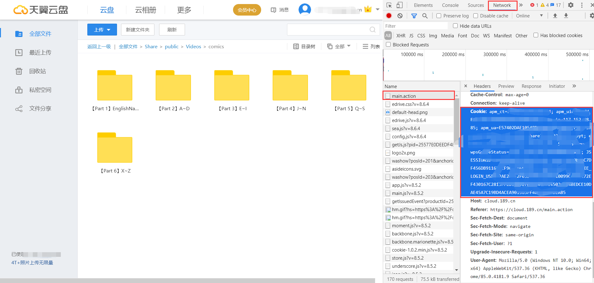

# 天翼云资源一键转存脚本
## 使用方法
填上cookie 和转存目标的文件夹ID即可一键转存
## 获取方法
登录天翼云网盘网页版，右键`检查`或者直接`F12`调出`Network`页面

1. cookie： 
刷新一下网页点击`main.action`查看`Headers`下拉即可找到`Cookie`选项

2. 目标文件夹ID： 
点击进入你要存储的文件夹，复制顶栏连接`folder/`的id即可
